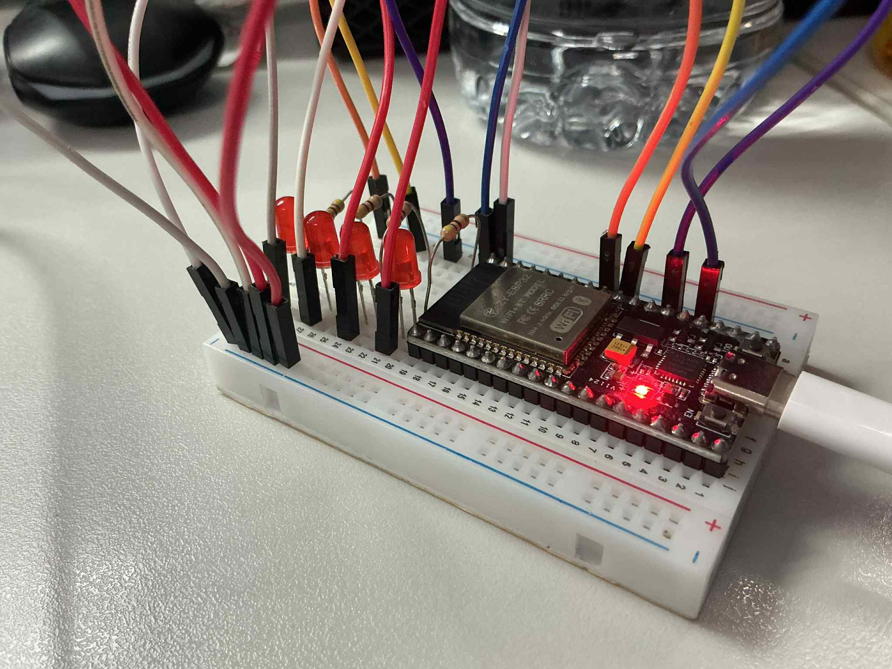
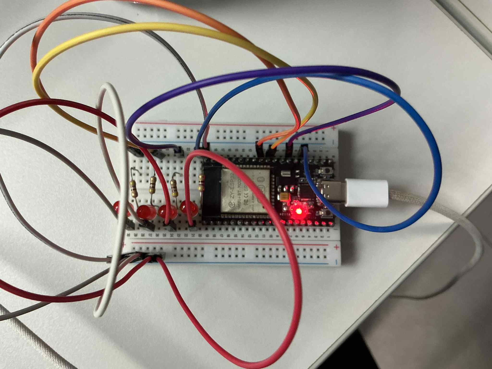

## รูปภาพ

## การทดสอบและวัดผล

### 1. การวัด CPU Utilization
- สังเกตการแสดงสถิติทุก 20 context switches
- บันทึกค่า CPU utilization และ overhead

### 2. การทดสอบ Time Slice ต่างๆ
- ทดสอบ time slice: 10ms, 25ms, 50ms, 100ms, 200ms
- เปรียบเทียบประสิทธิภาพ

### 3. การสังเกต LED Pattern
- LED1: Sensor task (งานเบา)
- LED2: Processing task (งานหนัก)
- LED3: Actuator task (งานปานกลาง)
- LED4: Display task (งานเบา)

## ผลการวิเคราะห์

**1. Time slice ขนาดไหนให้ประสิทธิภาพดีที่สุด? เพราะอะไร?**
*   **คำตอบ:** Time slice ขนาดปานกลาง (เช่น 50ms หรือ 100ms) มักจะให้ประสิทธิภาพโดยรวมดีที่สุด
*   **เหตุผล:**
    *   **Time slice ที่ไม่สั้นเกินไป** จะช่วยลด *Overhead* จากการสลับ Context (Context Switching) ซึ่งเป็นเวลาที่ CPU ต้องใช้ในการบันทึกสถานะของ task เก่าและโหลดสถานะของ task ใหม่ ทำให้มีเวลาเหลือสำหรับทำงานจริง (Task execution) มากขึ้น
    *   **Time slice ที่ไม่ยาวเกินไป** จะช่วยให้ระบบมีการตอบสนอง (Responsiveness) ที่ดี ทุก Task จะได้รับโอกาสให้ทำงานอย่างสม่ำเสมอ Task ที่เบาและสั้นจะทำงานเสร็จเร็วโดยไม่ต้องรอ Task ที่หนักและนานทำงานจนจบ

**2. ปัญหาอะไรที่เกิดขึ้นเมื่อ time slice สั้นเกินไป?**
*   **คำตอบ:** **Context Switching Overhead สูงมาก**
*   **เหตุผล:** เมื่อ time slice สั้น (เช่น 10ms) CPU จะต้องสลับการทำงานของ Task บ่อยครั้งเกินไป เวลาส่วนใหญ่จะถูกใช้ไปกับกระบวนการ Context Switching แทนที่จะได้ประมวลผลงานจริงๆ ทำให้ประสิทธิภาพของระบบโดยรวมลดลงอย่างมาก หรือที่เรียกว่าเกิดภาวะ **Thrashing**

**3. ปัญหาอะไรที่เกิดขึ้นเมื่อ time slice ยาวเกินไป?**
*   **คำตอบ:** **การตอบสนองของระบบไม่ดี (Poor Responsiveness)**
*   **เหตุผล:** เมื่อ time slice ยาว (เช่น 200ms) Task ที่ต้องรอ (เช่น Sensor Task ที่อาจมีข้อมูลใหม่เข้ามา) จะต้องรอนานกว่าจะได้ทำงาน ทำให้ระบบไม่สามารถตอบสนองต่อเหตุการณ์ต่างๆ ได้ทันท่วงที ผู้ใช้อาจรู้สึกว่าระบบ "ค้าง" หรือ "กระตุก" เพราะ Task ที่ทำงานเบาๆ ไม่ได้รับโอกาสให้รัน

**4. Context switching overhead คิดเป็นกี่เปอร์เซ็นต์ของเวลาทั้งหมด?**
*   **คำตอบ:** จากโค้ด `simple-time-sharing.c` มีการคำนวณค่านี้และแสดงผลทาง `ESP_LOGI` ในตัวแปร `overhead_percentage` ครับ
*   **การวิเคราะห์:** เปอร์เซ็นต์ของ Overhead จะ **แปรผกผันกับขนาดของ Time slice**
    *   ถ้า Time slice **สั้น** -> Context switch บ่อย -> **Overhead สูง**
    *   ถ้า Time slice **ยาว** -> Context switch น้อย -> **Overhead ต่ำ**
    ค่าที่แน่นอนจะต้องดูจากผลลัพธ์ที่แสดงตอนรันโปรแกรมบนฮาร์ดแวร์จริง

**5. งานไหนที่ได้รับผลกระทบมากที่สุดจากการ time-sharing?**
*   **คำตอบ:** **Processing task (งานหนัก)**
*   **เหตุผล:** Task ที่ต้องใช้พลังการประมวลผลสูงและใช้เวลานานจะถูกขัดจังหวะบ่อยครั้งโดย Scheduler เพื่อให้ Task อื่นได้ทำงานบ้าง ทำให้เวลาที่ใช้ในการทำงานให้เสร็จสมบูรณ์ (Completion Time) จะนานกว่าการรันแบบต่อเนื่องโดยไม่มีการขัดจังหวะ ในขณะที่ Task งานเบาๆ อาจทำงานเสร็จภายใน Time slice เดียวจึงไม่ค่อยได้รับผลกระทบมากนัก
