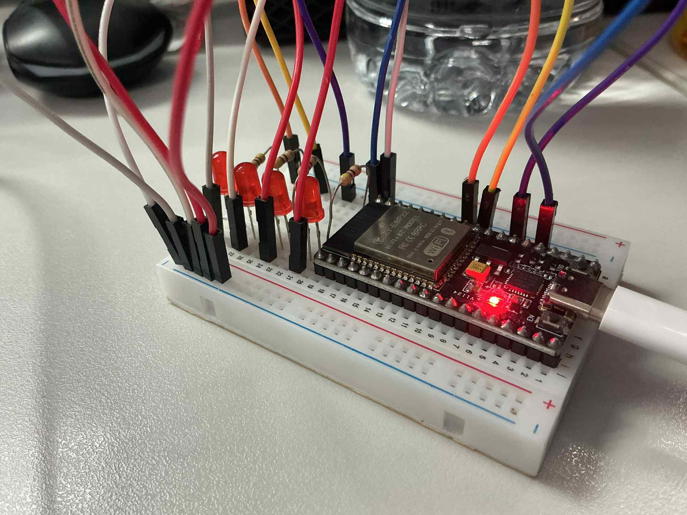
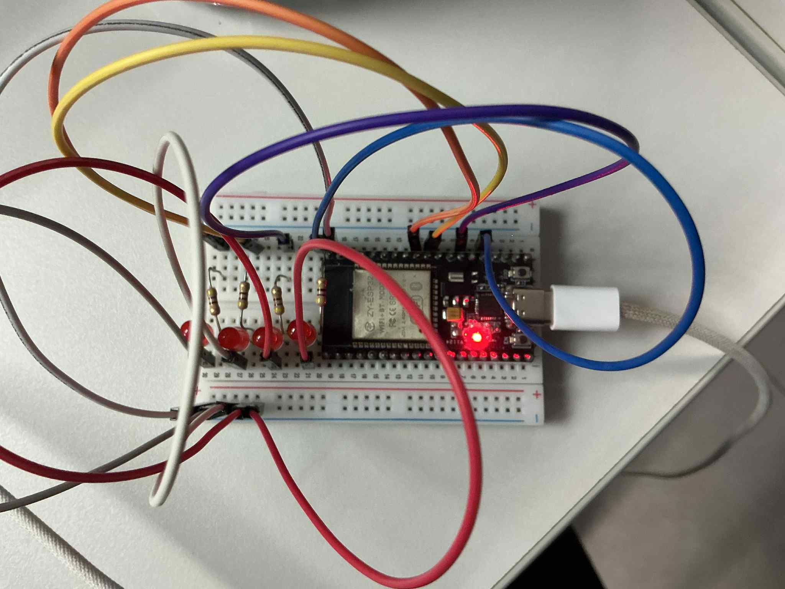

## รูปภาพ

## การทดสอบและเปรียบเทียบ

### การทดสอบ Cooperative System
1. Build และ flash โปรแกรมโดย uncomment `test_cooperative_multitasking()`
2. กดปุ่มหลายครั้งและสังเกตเวลาตอบสนอง
3. บันทึกเวลาตอบสนองสูงสุด

### การทดสอบ Preemptive System
1. แก้ไขโค้ดโดย uncomment `test_preemptive_multitasking()`
2. Build และ flash ใหม่
3. กดปุ่มหลายครั้งและเปรียบเทียบเวลาตอบสนอง

## ผลการวิเคราะห์

**1. ระบบไหนมีเวลาตอบสนองดีกว่า? เพราะอะไร?**
*   **คำตอบ:** **Preemptive Multitasking** มีเวลาตอบสนองดีกว่าอย่างชัดเจน
*   **เหตุผล:** ในระบบ Preemptive, Task ที่มีความสำคัญสูง (เช่น `preemptive_emergency_task`) สามารถหยุดการทำงานของ Task ที่มีความสำคัญต่ำกว่าได้ทันทีเมื่อต้องการทำงาน ในทางกลับกัน ระบบ Cooperative ต้องรอให้ Task ที่ทำงานอยู่ (เช่น `cooperative_task2` ที่ทำงานนาน) คืนสิทธิ์การควบคุม CPU ด้วยตัวเองก่อน ซึ่งอาจทำให้เกิดความล่าช้า (Latency) ในการตอบสนองต่อเหตุการณ์เร่งด่วน

**2. ข้อดีของ Cooperative Multitasking คืออะไร?**
*   **คำตอบ:**
    1.  **เรียบง่าย (Simplicity):** การออกแบบ Scheduler และ Task ทำได้ง่ายกว่า ไม่ซับซ้อนเท่า Preemptive
    2.  **Overhead ต่ำ:** มี Overhead จากการสลับ Context น้อยกว่า เพราะการสลับ Task จะเกิดขึ้น ณ จุดที่โปรแกรมเมอร์กำหนดไว้เท่านั้น
    3.  **ป้องกัน Race Condition ได้ง่าย:** เนื่องจาก Task จะไม่ถูกขัดจังหวะในขณะทำงาน ทำให้การเข้าถึงข้อมูลที่ใช้ร่วมกัน (Shared Resources) มีความปลอดภัยมากกว่า ไม่จำเป็นต้องใช้กลไกป้องกันที่ซับซ้อนอย่าง Mutex หรือ Semaphore เสมอไป

**3. ข้อเสียของ Cooperative Multitasking คืออะไร?**
*   **คำตอบ:**
    1.  **การตอบสนองไม่แน่นอน:** Task ที่สำคัญอาจต้องรอนาน หากมี Task อื่นที่ทำงานนานและไม่ยอมคืนสิทธิ์ (Yield) ให้ CPU
    2.  **ความรับผิดชอบของโปรแกรมเมอร์:** โปรแกรมเมอร์ต้องออกแบบ Task ให้ดีและมั่นใจว่าทุก Task จะมีการคืนสิทธิ์การทำงานอย่างสม่ำเสมอ หากมี Task ใด Task หนึ่งทำงานผิดพลาดและไม่ยอมคืนสิทธิ์ (เช่น ติดอยู่ใน Loop) ระบบทั้งหมดจะหยุดทำงาน (Hang)

**4. ในสถานการณ์ใดที่ Cooperative จะดีกว่า Preemptive?**
*   **คำตอบ:** ในระบบขนาดเล็กมากๆ ที่มีทรัพยากรจำกัด (เช่น ไมโครคอนโทรลเลอร์รุ่นเก่าที่มี RAM/ROM น้อย) และ Task การทำงานไม่ซับซ้อน สามารถคาดเดาพฤติกรรมได้ง่าย การใช้ Cooperative จะช่วยประหยัดทรัพยากรและลดความซับซ้อนของโค้ดได้

**5. เหตุใด Preemptive จึงเหมาะสำหรับ Real-time systems?**
*   **คำตอบ:** เพราะ Real-time systems ต้องการ **การรับประกันเวลาในการตอบสนอง (Guaranteed Response Time)**
*   **เหตุผล:** ระบบ Preemptive สามารถจัดลำดับความสำคัญของงานได้ เมื่อมีเหตุการณ์เร่งด่วนเกิดขึ้น Task ที่จัดการเหตุการณ์นั้น (ซึ่งมี Priority สูง) จะได้รับประกันว่าจะได้ทำงานทันที ทำให้ระบบสามารถตอบสนองต่อเหตุการณ์วิกฤตได้ภายในเวลาที่กำหนด ซึ่งเป็นหัวใจสำคัญของระบบ Real-time เช่น ระบบควบคุมเบรกรถยนต์ หรือเครื่องมือแพทย์
