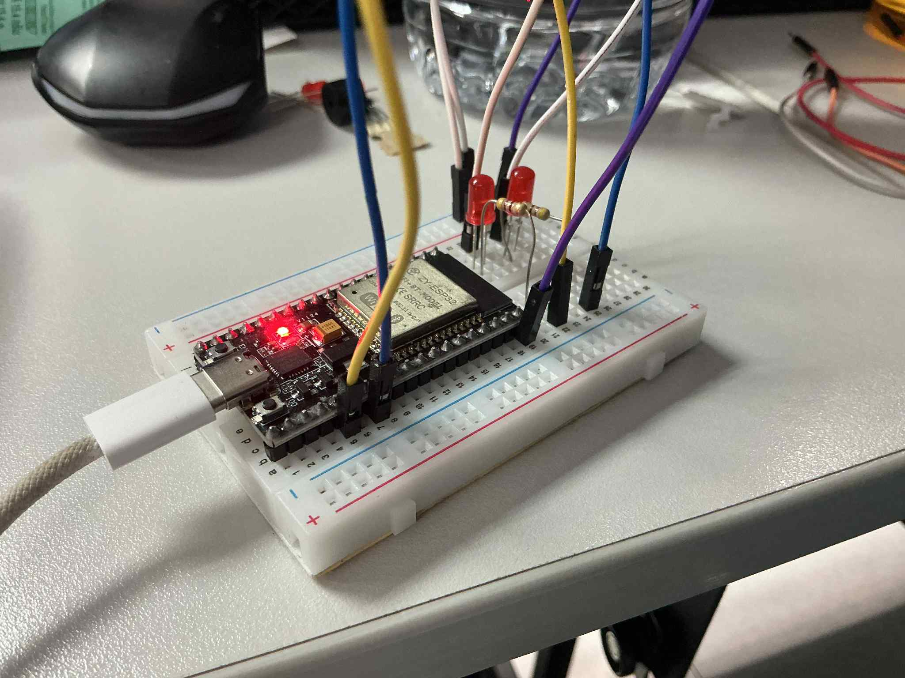
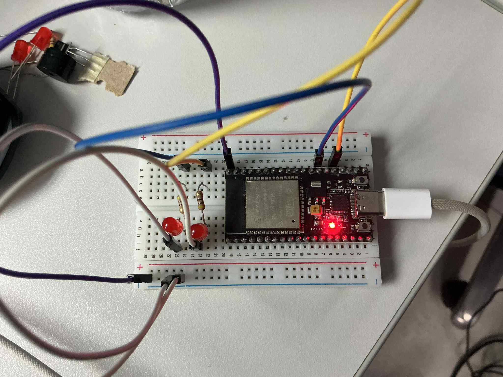

## รูปภาพ

## 🚀 ความท้าทายเพิ่มเติม

1. **Priority Queue**: ปรับปรุงให้ข้อความมี Priority
2. **Multiple Senders**: เพิ่ม Sender หลายตัว
3. **Queue Statistics**: เพิ่มการนับ dropped messages
4. **Dynamic Queue Size**: ทดลองขนาด Queue ต่างๆ
